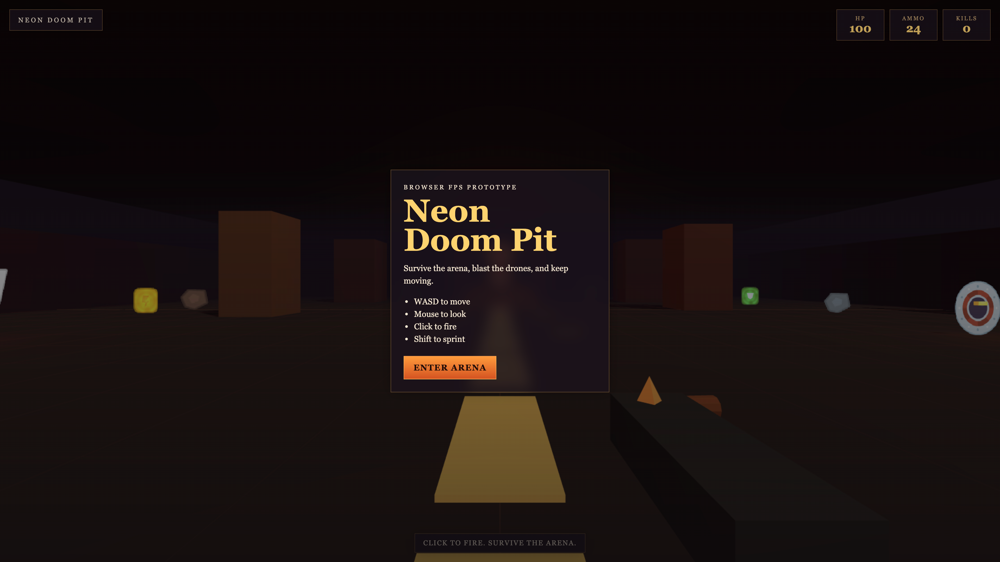

# Neon Doom Pit

Neon Doom Pit is a small browser FPS prototype built with Vite, TypeScript, and three.js. The game keeps a deliberately compact scope: one arena, short wave-based combat, pointer-lock controls, hitscan shooting, simple enemy AI, and a HUD/overlay flow that fits fast iteration.

It started as a quick experiment in what a simple prompt to a coding agent could produce, then turned into a small game worth polishing and sharing.

## Stack

- TypeScript
- Vite
- three.js
- `PointerLockControls`
- `pnpm`

## Public Repo Notes

- Code license: MIT
- Included sprite assets: derived from Kenney packs and kept in `apps/web/public/sprites/`
- Kenney asset license: CC0 / public domain

## Play Online

- GitHub Pages: `https://paulatkins88.github.io/neon-doom-pit/`

The Pages build deploys automatically from `main` via GitHub Actions.

## Scripts

- `pnpm dev`: run the local development server
- `pnpm dev:server`: run the authoritative multiplayer room server
- `pnpm build`: production build and main verification command
- `pnpm preview`: preview the production build locally

For multiplayer backend changes, also run:

- `pnpm --filter @neon/server build`

## Gameplay Summary

- Click the overlay button or canvas to enter pointer lock
- Move with `W`, `A`, `S`, `D`
- Hold `Shift` to sprint
- Click to fire
- Press `R` to reload
- Survive three waves to clear the arena

## Architecture

The codebase is intentionally split into a few small layers rather than a large engine.

### Workspace

- `apps/web`
  - browser client app built with Vite
- `apps/server`
  - authoritative multiplayer room server
- `packages/shared`
  - shared ids, snapshots, and protocol contracts

### Entry

- `apps/web/src/main.ts`
  - boots the game runtime

### Core

- `apps/web/src/core/Game.ts`
  - top-level coordinator for boot, loop, input wiring, wave flow, and restart/game-over transitions
- `apps/web/src/core/GameState.ts`
  - mutable run/session state used by the loop
- `apps/web/src/core/contracts.ts`
  - shared interfaces like `Collider` and `Damageable`
- `apps/web/src/core/matchSnapshot.ts`
  - browser-side adapter that exposes the local runtime as a typed match snapshot

### World

- `apps/web/src/world/GameWorld.ts`
  - owns the scene, arena bounds, colliders, and spawn point data
- `apps/web/src/world/ArenaFactory.ts`
  - builds static arena geometry, lighting, altar, exit marker, guide path, and decorative sprite props

### Render

- `apps/web/src/render/assets.ts`
  - shared texture loading and caching for sprite assets
- `apps/web/src/render/billboards.ts`
  - camera-facing billboard helper for pickups, projectiles, monsters, and props

### Entities

- `apps/web/src/entities/GameObject.ts`
  - base class for meaningful runtime objects
- `apps/web/src/entities/Actor.ts`
  - base class for damageable objects with health and radius
- `apps/web/src/entities/Player.ts`
  - player movement, combat state, reloads, and first-person gun mesh
- `apps/web/src/entities/Pickup.ts`
  - floating pickup entity and collision logic
- `apps/web/src/entities/Projectile.ts`
  - projectile lifetime and hit logic
- `apps/web/src/entities/monsters/Monster.ts`
  - shared enemy behavior base
- `apps/web/src/entities/monsters/*.ts`
  - concrete monster subclasses for each enemy type
- `apps/web/src/entities/monsters/MonsterFactory.ts`
  - typed factory for monster creation

### Systems

- `apps/web/src/systems/InputSystem.ts`
  - browser input listeners and tracked key state
- `apps/web/src/systems/HudSystem.ts`
  - DOM/HUD/overlay updates and flashes
- `apps/web/src/systems/CombatSystem.ts`
  - hitscan shooting and projectile collision resolution
- `apps/web/src/systems/WaveSystem.ts`
  - wave composition, respawns, and victory transition timing

### Config and Utilities

- `apps/web/src/config/gameConfig.ts`
  - arena and player constants
- `apps/web/src/config/monsterConfigs.ts`
  - typed monster stats and visuals
- `apps/web/src/config/spriteConfig.ts`
  - sprite file paths, sizing, and billboard tuning for pickups, monsters, props, and projectiles
- `apps/web/src/utils/math.ts`
  - small math/collision helpers
- `packages/shared/src/*`
  - shared multiplayer contracts used by both browser and server apps

## Design Rules

- Keep the architecture pragmatic. This is not a general-purpose engine.
- Treat meaningful runtime actors as `GameObject`-style entities.
- Prefer composition and focused helpers before introducing broad abstraction layers.
- Preserve game feel unless a change is necessary for correctness or maintainability.
- Keep static decorative geometry in the world layer unless it gains interactive behavior.
- Prefer typed config and small subclass overrides over large conditional blocks.

## Monster Extension Pattern

Current monster design is intentionally extension-friendly without overengineering.

- Shared base behavior lives in `Monster`
- Type-specific behavior lives in subclasses such as `GruntMonster` and `SpitterMonster`
- Shared reusable movement/visual helpers live in `apps/web/src/entities/monsters/behaviors.ts`
- Future status effects can use `MonsterEffectHook`

When adding a new enemy type:

1. Add its typed config in `apps/web/src/config/monsterConfigs.ts`
2. Create a subclass in `apps/web/src/entities/monsters/`
3. Override only the movement/attack behavior that actually differs
4. Register it in `MonsterFactory.ts`
5. Add it to `WaveSystem` if it should spawn in normal waves

## Recommended Workflow

1. Read the relevant runtime files first
2. Keep edits small and local
3. Reuse existing config/constants and factory patterns
4. Prefer `pnpm build` after non-trivial changes
5. For gameplay changes, manually test with `pnpm dev` when practical

## Multiplayer Local Run

To exercise the co-op flow locally:

1. Start the room server with `pnpm dev:server`
2. Start the web client with `pnpm dev`
3. Open the game in two browser tabs or windows
4. Create a room in one client and join it from the second client with the room code
5. Use reconnect after closing one tab to verify the grace-window flow

The browser client targets `ws://localhost:2567` by default. Override the port with `VITE_MULTIPLAYER_SERVER_PORT` if needed.

## Multiplayer QA Matrix

Manual coverage for the current MVP should include:

1. Room flow: create room, join room, start run, reconnect after disconnect, reconnect after expiry, session replacement from a second tab
2. Sync flow: both players can move, rotate, shoot, reload, pick up items, kill monsters, and advance waves while seeing the same authoritative outcomes
3. Failure flow: invalid room code, missing room, expired room, expired session token, and disconnected server all produce clear UI feedback
4. Cleanup flow: no ghost remote players, projectiles, monsters, or pickups remain after reconnect, room expiry, game over, or starting a new room
5. Latency tolerance: remote actors stay readable under moderate added latency, while local rubber-banding remains acceptable for the current no-prediction MVP

## Known Multiplayer Limits

Current intentional limits for the MVP:

- maximum of 2 players per room
- authoritative snapshots run at a fixed 20 Hz tick
- client-side interpolation is lightweight and there is no full prediction/reconciliation path yet
- reconnect is user-driven rather than fully automatic
- payload validation is intentionally shallow and focused on the shared protocol contract

## Agent Prompt Pack

Reusable prompt templates for OpenCode, Claude, Copilot Chat, or custom slash commands live in:

- `docs/prompt-pack.md`

## OpenCode Commands

OpenCode command files live in:

- `.opencode/commands/`

Included commands:

- `/add-monster`
- `/add-weapon`
- `/rebalance`
- `/add-pickup`
- `/edit-arena`
- `/fix-gameplay`
- `/refactor-safe`
- `/add-monster-effect`
- `/sync-docs`
- `/plan-feature`

## Verification Expectations

Minimum:

- `pnpm build`

For gameplay-heavy changes, also verify manually:

- game boots
- pointer lock works
- player can move and shoot
- HUD updates correctly
- enemies spawn, attack, and die
- wave progression still completes

For multiplayer changes, also verify manually:

- room create, join, reconnect, and expiry flows
- remote player, projectile, monster, and pickup sync
- session replacement from another tab/browser
- no stale replicated actors remain after disconnect or room change

## Asset Credits

Included sprites in `apps/web/public/sprites/` were derived from open-license Kenney packs during development, primarily `Space Shooter Redux` and `Particle Pack`.

- Kenney: https://kenney.nl/assets/space-shooter-redux
- Kenney: https://kenney.nl/assets/particle-pack

Those Kenney packs are distributed under CC0, which makes them a good fit for a public demo repository.

## Future Work Ideas

- weapon abstraction for multiple guns
- pickups and power-ups as additional `GameObject` types
- richer monster effects using `MonsterEffectHook`
- multiple arenas or encounter layouts via additional world builders
